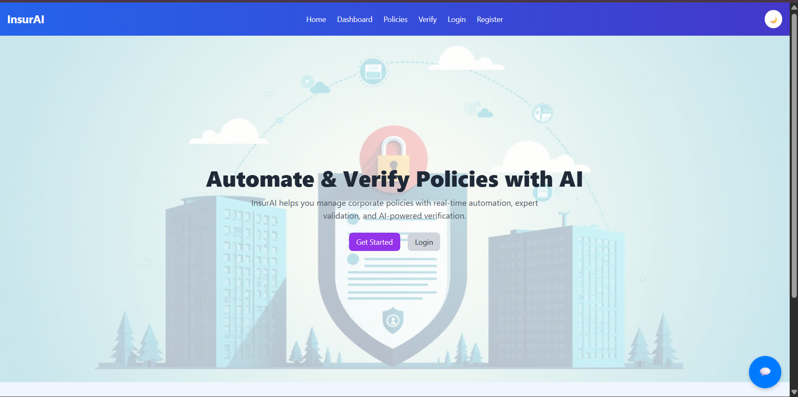
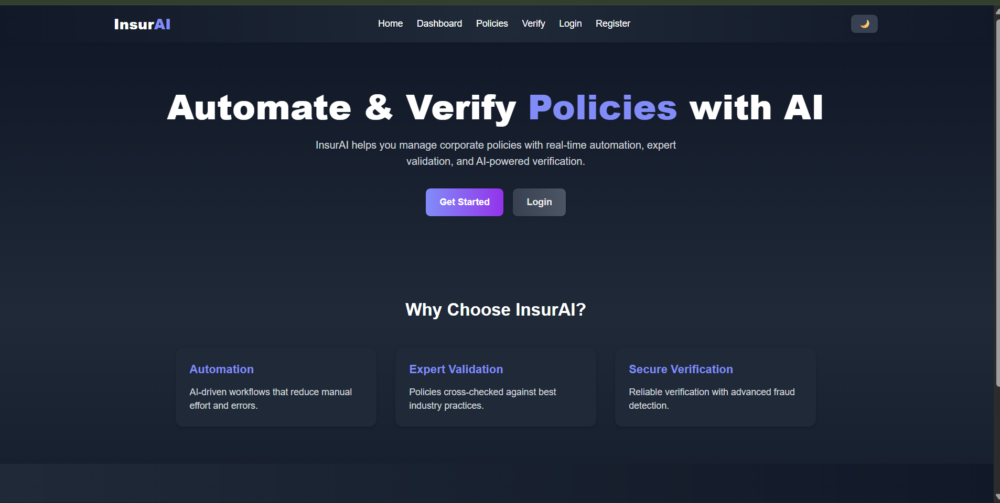
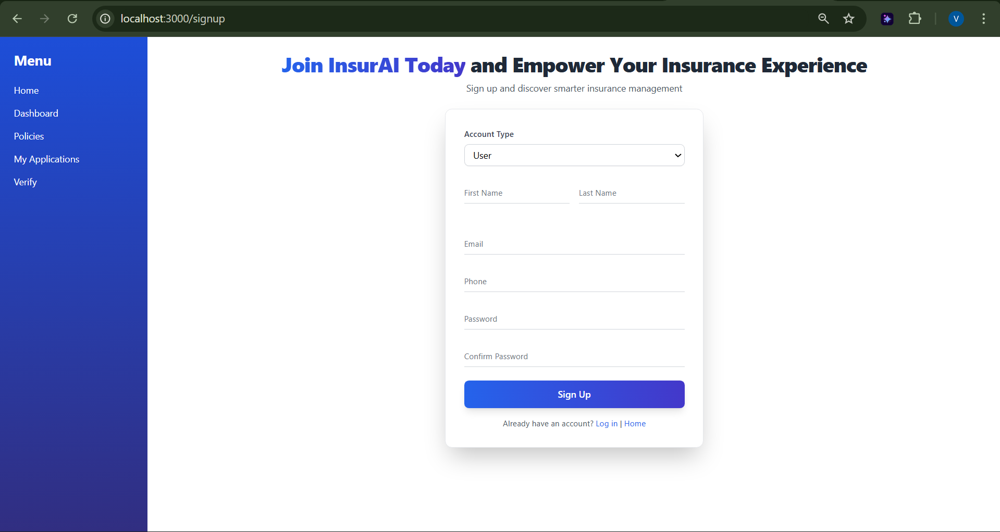
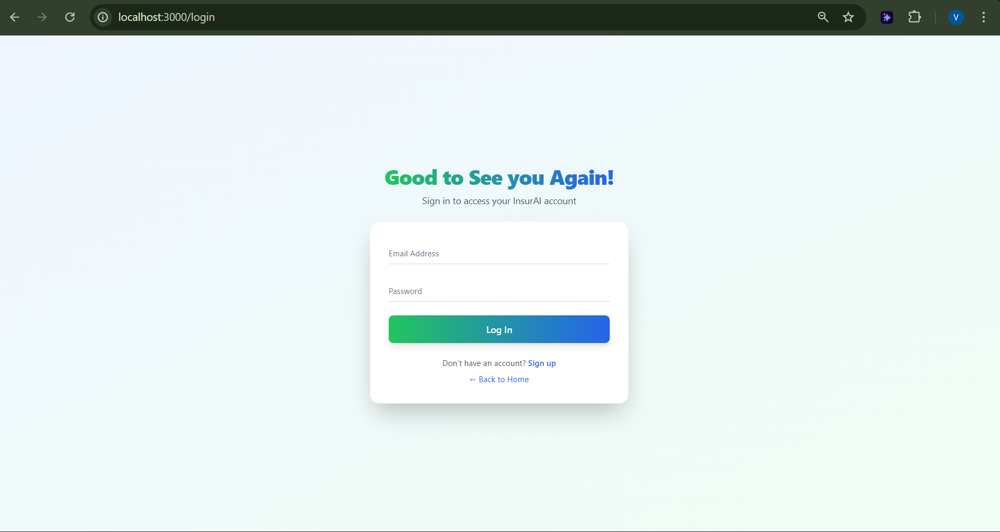
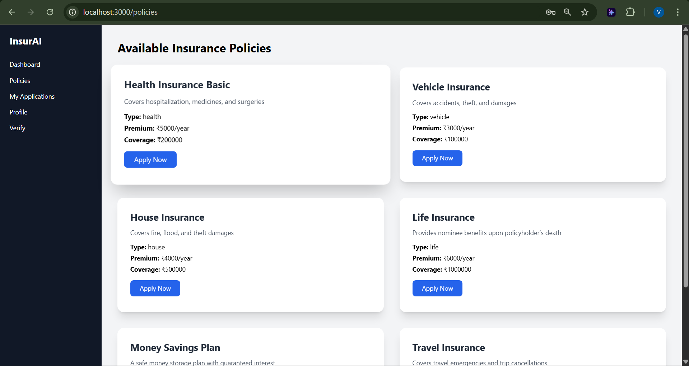
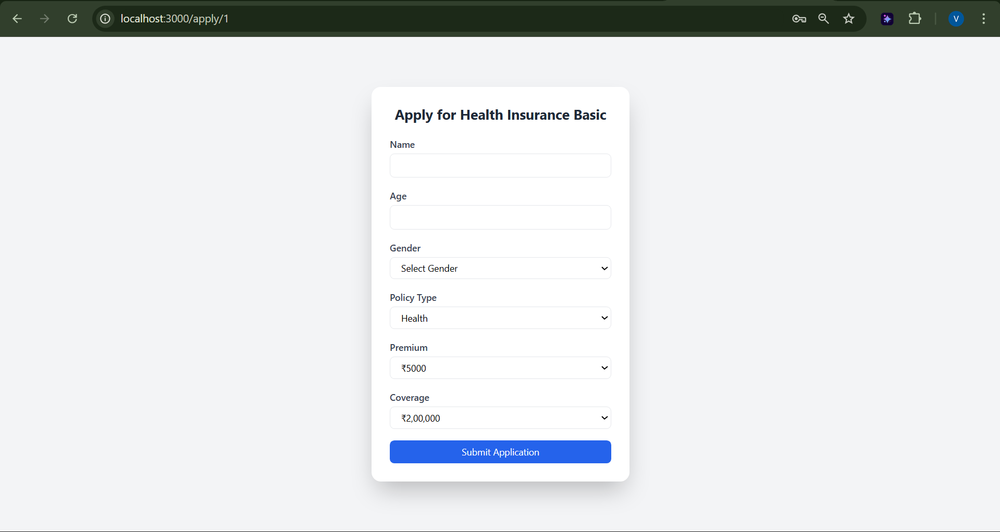
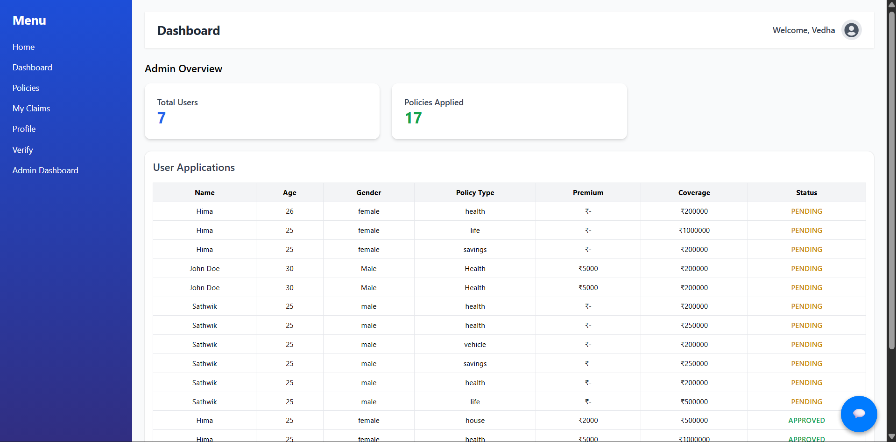
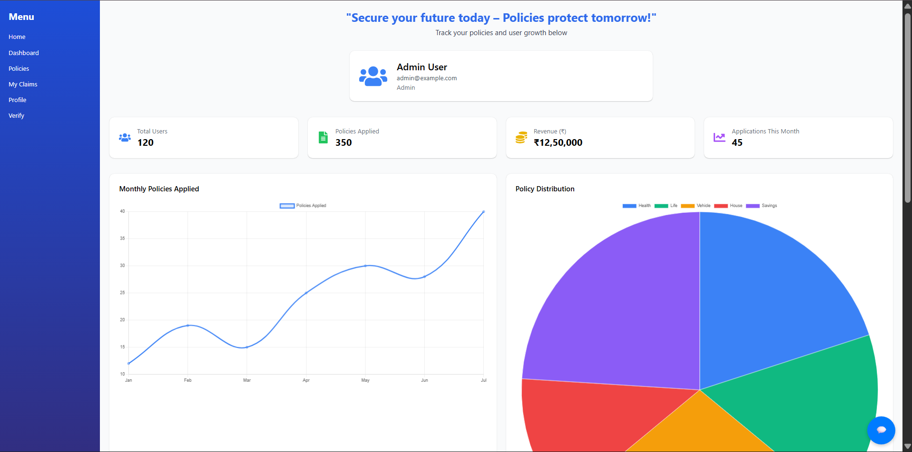

---

# 📌 InsurAI – Corporate Policy Automation & Intelligence System

InsurAI is a **React + Node.js + MySQL-based platform** that helps organizations **automate, validate, and verify corporate policies** using **AI-driven workflows** and **expert-backed checks**.

---

## ✨ Features

* 🔑 **User Authentication** (Login/Register)
* 📊 **Dashboard** with active & pending policy stats
* 📂 **Policy Management** – create, update, and track policies
* ✅ **Policy Verification** – AI-driven fraud detection & validation
* 🎨 **Modern UI** – React + TailwindCSS + Framer Motion animations
* 🔒 **Secure Access** – JWT-based authentication

---

## 🏗️ Tech Stack

**Frontend**

* React (Hooks, Router)
* TailwindCSS (UI styling)
* Framer Motion (animations)

**Backend**

* SpringBoot
* JWT for authentication
* REST API architecture

**Database**

* MySQL (for structured data)

**API Testing**
* Postman

---
## Sample Results

Welcome to Home Page 😊

---

Dark Theme Toggle used Hooks

---

New Account Creation👪

---

Login Page 🧍🏻

---

Policies Page Upload,read..📃

---

Application Form For Policies...

---

System Administrator Dashboard..💻

---

Analysis in Admin Profile

---

